# Redis Data Type

## Strings

- 가장 기본적인 데이터 타입으로 제일 많이 사용됨
- 바이트 배열로 저장됨! (binary-safe)
    - 모든 문자를 표현 할 수 있음!
- 바이너리로 변환할 수 있는 모든 데이터를 저장가능 (JPG와 같은 파일 등)
- 최대 크기는 512MB

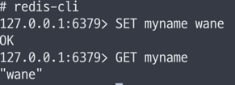

### Strings 주요 명령어

| 명령어  | 기능                               | 예제                                                                                           |
|------|----------------------------------|----------------------------------------------------------------------------------------------|
| SET  | 특정 키에 문자열 값을 저장한다                | SET name wane                                                                                |
| GET  | 특정 키의 문자열 값을 얻어온다                | GET name                                                                                     |
| INCR | 특정 키의 값을 Integer로 취급하여 1 증가 시킨다. | INCR count                                                                                   |
| DECR | 특정 키의 값을 Integer로 취급하여 1 감소 시킨다. | DECR count                                                                                   |
| MSET | 여러 키에 대한 값을 한번에 저장한다.            | MSET mine milk yours coffee  (key : mine ,value: milk ) (key: yours , value: coffee) |
| MGET | 여러 키에 대한 값을 한번에 얻어온다.            | MGET mine yours                                                                              |      

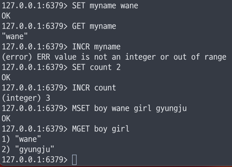

## Lists

- Linked-list 형태의 자료구조
    - 인덱스 접근은 느리지만
    - **데이터 추가/삭제가 빠름!**
- Queue와 Stack으로 사용할 수 있음!

### Lists 주요 명령어

| 명령어    | 기능                          | 예제                      |
|--------|-----------------------------|-------------------------|
| LPUSH  | 리스트의 왼쪽(head)에 새로운 값을 추가    | LPUSH myList apple      |
| RPUSH  | 리스트의 오른쪽(tail)에 새로운 값을 추가   | RPUSH myList banana     |
| LLEN   | 리스트에 들어있는 아이템 개수를 반환        | LLEN mylist -> 2        |
| LRANGE | 리스트의 특정 범위를 반환한다.           | LRANGE mylist 0 -1(마지막) |
| LPOP   | 리스트의 왼쪽(head)에서 값을 삭제하고 반환  | LPOP mylist -> 2        |
| RPOP   | 리스트의 오른쪽(tail)에서 값을 삭제하고 반환 | RPOP mylist -> 1        |

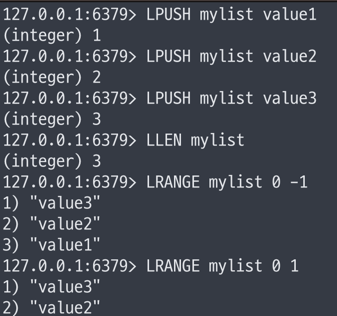

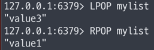

## Sets

- 순서가 없는 유니크한 값의 집합
- **검색이 빠름**
- 개별 접근을 위한 인덱스가 존재하지 않고, 집합 연산이 가능 ! (교집합, 합집합 등)

- e.x. 유저가 쿠폰을 발행 했는지 id값을 넣어서 확인하는 경우가 있음!

### Sets 주요 명령어

| 명령어       | 기능                      | 예제                    |
|-----------|-------------------------|-----------------------|
| SADD      | Set에 데이터를 추가            | SADD myset apple      |
| SREM      | Set에서 데이터를 삭제           | SREM myset apple      |
| SCARD     | Set에 저장된 아이템 개수를 반환     | SCARD myset           |
| SMEMBERS  | Set에 저장된 아이템들을 반환       | SMEMBERS myset        |
| SISMEMBER | 특정 값이 Set에 포함되어 있는지를 반환 | SISMEMBER myset apple |

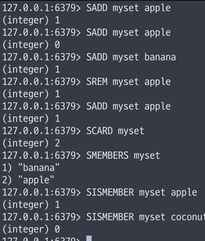

## SortedSets

- Set과 유사하게 유니크한 값의 집합
- 각 값은 연관된 score를 가지고 정렬되어 있음
- 정렬된 상태이기에 빠르게 최소/ 최대값을 구할 수 있음
- e.x. 순위 계산, 리더보드 구현 등에 활용

### SortedSets 주요 명령어

| 명령어      | 기능                                      | 예제                                      |
|----------|-----------------------------------------|-----------------------------------------|
| ZADD     | 한개 또는 다수의 값을 추가 또는 업데이트                 | ZADD myrank 30 grape 20 banana 10 apple |
| ZRANGE   | 특정 범위의 값을 반환(score 낮은 것 부터, 오름차순 정렬 기준) | ZRANGE myrank 0 1                       |
| ZRANK    | 특정 값의 위치(순위)를 반환(score 오름차순 정렬 기준)      | ZRANK myrank apple                      |
| ZREVRANK | 특정 값의 위치(순위)를 반환(score 내림차순 정렬 기준)      | ZREVRANK myrank apple                   |
| ZREM     | 한개 이상의 값을 삭제                            | ZREM myrank apple                       |

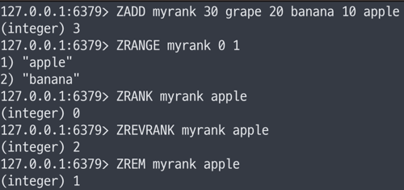

## Hashes

- **하나의 key 하위에** **여러개의 field-value 쌍을 저장**
- 여러 필드를 가진 객체를 저장하는 것으로 생각할 수 있음
- `HINCRBY` 명령어를 사용해 카운터로 활용 가능

### Hashes 주요 명령어

| 명령어     | 기능                                 | 예제                          |
|---------|------------------------------------|-----------------------------|
| HSET    | 한개 또는 다수의 필드에 값을 저장                | HSET user1 name bear age 10 |
| HGET    | 특정 필드의 값을 반환한다.                    | HGET user1 name             |
| HMGET   | 한개 이상의 필드 값을 반환                    | HMGET user1 name age        |
| HINCRBY | 특정 필드의 값을 Integer로 취급하여 지정한 숫자를 증가 | HINCRBY user1 viewcount 1   |
| HDEL    | 한개 이상의 필드를 삭제한다.                   | HDEL user1 name age         |

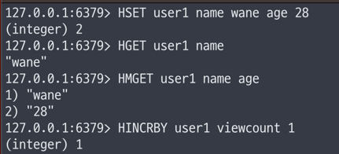

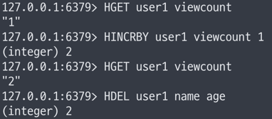

## Bitmaps

- **비트 벡터를 사용해 N개의 Set을 공간 효율적으로 저장**
- 하나의 비트맵이 가지는 공간은 약 42억개의 비트
- 비트 연산 가능 

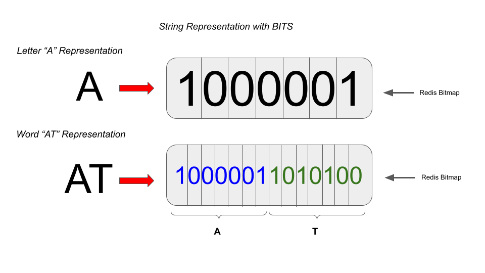

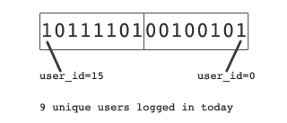

| 명령어      | 기능                              | 예제                                                                              |
|----------|---------------------------------|---------------------------------------------------------------------------------|
| SETBIT   | 비트맵의 특정 오프셋에 값을 변경              | SETBIT visit 10 1                                                               |
| GETBIT   | 비트맵의 특정 오프셋의 값을 반환              | GETBIT visit 10                                                                 |
| BITCOUNT | 비트맵에서 set(1) 상태인 비트의 개수를 반환     | BITCOUNT visit                                                                  |
| BITOP    | 비트맵들간의 비트 연산을 수행하고, 결과를 비트맵에 저장 | BITOP AND result today yesterday  BITOP (AND, OR) 담을 bitmap bitmap list들,,, |

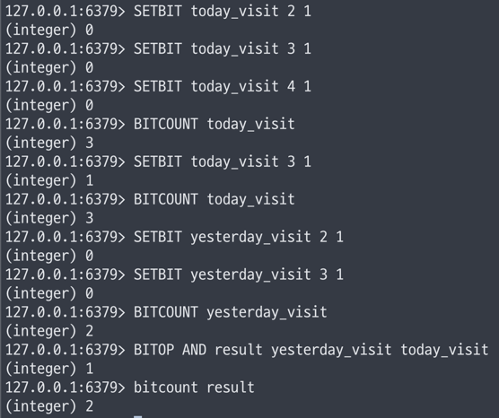

## HyperLogLog
- **유니크한 값의 개수를 효율적으로 얻을 수 있음**
- **확률적 자료구조**로서 오차가 있으며, 매우 큰 데이터를 다룰 때 사용
- 2^64개의 유니크 값을 계산 가능
- 12KB까지 메모리를 사용하며 0.81%의 오차율을 허용

- e.x. 어떤 문자열이든 사용할 수 있어서 이름, 브라우저 ID, PC Hardware ID등을 가질 수 있음

| 명령어     | 기능                                            | 예제                           |
|---------|-----------------------------------------------|------------------------------|
| PFADD   | HyperLogLog에 값들을 추가                           | PFADD visit Jay Peter Jane   |
| PFCOUNT | HyperLogLog에 입력된 값들의 cardinality(유일값의 수) 를 반환 | PFCOUNT visit                |
| PFMERGE | 다수의 HyperLogLogㅡㄹ 병합                          | PFMERGE result visit1 visit2 |

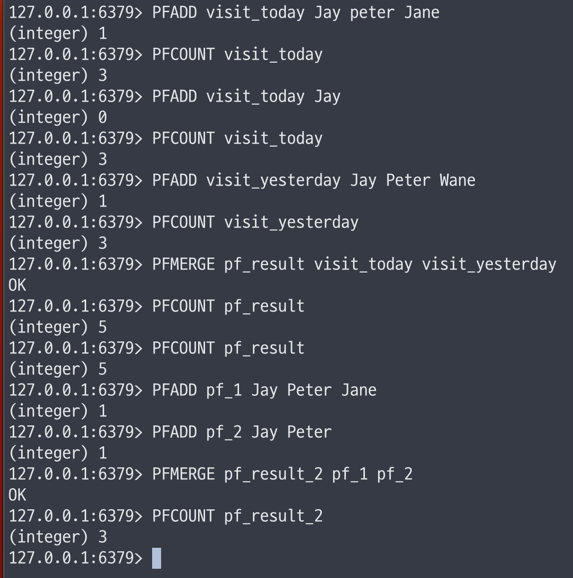