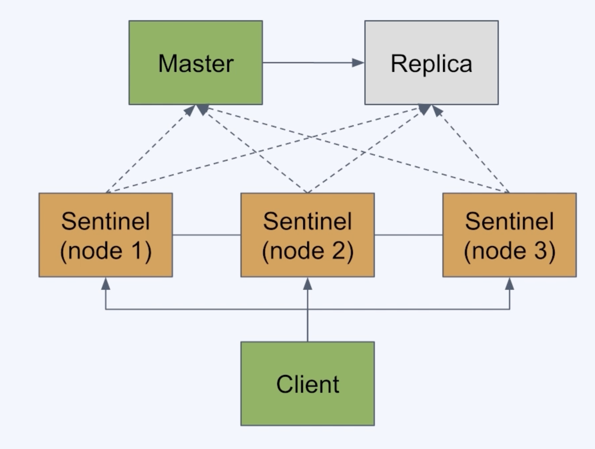

# Redis의 백업과 장애 복구 

## RDB(Redis Database) 를 사용한 백업

- 특정 시점의 스냅샷으로 데이터 저장 
- 재시작 시 RDB 파일이 있으면, 읽어서 복구 



### RDB 사용의 장점
- 작은 파일 사이즈로 백업 파일 관리가 용이 (원격지 백업(e.x.s3), 버전 관리 등)
- fork를 이용해 백업하므로 **서비스중인 프로세스는 성능에 영향 없음**
- 데이터 스냅샷 방식이므로 빠른 복구가 가능!

### RDB 사용의 단점 
- 스냅샷을 **저장하는 시점 사이의 데이터 변경사항은 유실될 수 있음**
- fork를 이용하기 때문에 시간이 오래 걸릴 수 있고, CPU와 메모리 자원을 많이 소모
- 데이터 무결성이나 정합성에 대한 요구가 크지 않은 경우 사용 가능
  - 마지막 백업 시 에러 발생등의 문제

## RDB 설정 
- 설정파일이 없어도 기본값으로 RDB를 활성화되어 있음
- 설정 파일 만들려면 템플릿을 받아서 사용 
  - -> https://redis.io/docs/management/config/

```redis
-- redis.conf
-- **저장 주기 설정**
save 60 10 //e.x. 60초 마다 10개 이상의 변경이 있을 때 수행

-- **스냅샷을 저장할 파일 이름**
dbfilename dump.rdb

-- **수동으로 스냅샷 저장**
bgsave

```

## AOF(Append Only File)를 사용한 백업
- 모든 쓰기 요청에 대한 **로그를 저장**
- 재시작 시 AOF에 기록된 모든 동작을 재수행해서 데이터를 복구
    - 모든 operation을 재실행!

### AOF 사용의 장점
- 모든 변경사항이 기록되므로 **RDB 방식 대비 안정적으로 데이터 백업 가능**
- AOF 파일은 append-only 방식이므로, **백업 파일이 손상될 위험이 적음**
- **실제 수행된 명령어가 저장되어 있으므로** 사람이 보고 이해할 수 있고, 수정도 가능

### AOF 사용의 단점
- RDB 방식보다 파일 사이즈가 커짐
- RDB 방식 대비 백업& 복구 속도가 느림
  - (백업 성능은 **fsync** 정책에 따라 조절 가능!) 
    - 그래도 RDB보다 조금 느림, 복구 속도 역시 모든 것을 리플레이 하는 방식이라 조금 더 느림

```redis
-- redis.conf
-- **AOF 사용(기본값은 NO)**
appendonly yes

-- **AOF 파일 이름**
appendfilename appendonly.aof

-- **fsync 정책 설정 [always, everysec, no]**
appendfsync everysec
```
### fsync 정책 (appendfsync 설정 값)
- fsync() 호출은 **OS에게 데이터를 디스크에 쓰도록 함**
  - 가능한 옵션과 설명
    - `always`: 새로운 커맨드가 추가될 때마다 수행. 가장 안전하지만 가장 느림 (DISK 쓰기 작업은 레이턴시가 큼) 
    - `everysec`: 1초마다 수행. 성능은 RDB 수준에 근접. **(보통 많이 사용!)**
    - `no` : OS에 맞김. 가장 빠르지만, 덜 안전한 방법 (커널마다 수행 시간이 다를 수 있음)

### AOF 관련 개념
- `Log rewriting`: 최종 상태를 만들기 위한 최소한의 로그만 남기기 위해 일부를 새로 씀
  - e.x. 1개의 key값을 100번 수정해도 최종 상태는 1개이므로 SET 1개로 대체 가능!
- `Multi Part AOF` : Redis 7.0 부터 AOF가 단일 파일에 저장되지 않고, 여러개가 사용됨!
  - **base file** : 마지막으로 rewrite 시의 스냅샷을 저장
  - **incremental file**: 마지막으로 base file이 생성된 이후의 변경사항이 쌓임
  - **manifest file**: 파일들을 관리하기 위한 메타 데이터를 저장

---

# Redis의 복제

## Redis replication
- 백업만으로는 장애 대비에 부족함 (백업 실패 가능성, 복구에 소요되는 시간)
- Redis도 복제를 통해 **가용성을 확보하고 빠른 장애조치가 가능**!
- master가 죽었을 경우, replica 중 하나를 master로 전환해 즉시 서비스 정상화 가능!
- 복제본(replica)는 read-only 노드로 사용 가능하므로, traffic 분산도 가능!
- 복제본의 복제본도 가능!

### Redis replication 사용

- Replica 노드에서만 설정을 적용해 master-replica 복제 구성 가능!

```redis
-- redis.conf
-- **Replica로 동작하도록 설정**
replicaof 127.0.0.1 6379

-- **Replica는 read-only로 설정**
replica-read-only
```
> Master 노드에는 RDB나 AOF를 이용한 **백업 기능 활성화가 필수!**
>
> 재시작 후에 비어있는 데이터 상태가 복제되지 않도록!

---

# Redis Sentinel 을 이용한 자동 장애 조치!

- 위의 레플리카만 설정한다고 하더라도 자동으로 master로 바꿔주지는 않음!

## Redis Sentinel
- Redis 에서 HA(High Availability)를 제공하기 위한 장치
- master-replica 구조에서 master가 다운 시 **replica를 master로 승격시키는 auto-failover 를 수행!**

### Sentinel의 기능
- 모니터링
- 알림
- 자동 장애 복구
- 환경 설정 제공자

### Redis Sentinel 실제 구성도 


- Sentinel 노드는 3개 이상으로 구성 (Quorum 때문 : 의사를 진행시키거나 의결을 하는 데 필요한 최소한도의 인원수)
- Sentinel들은 서로 연결되어 있음
- Sentinel들은 Redis master와 replica를 모니터링
- Client는 Sentinel을 통해 Redis에 접근


### Redis Sentinel 특징 
- **SDOWN(Subjective down : 주관적 down)** 과 **ODOWN(Objective down 객관적 down)** 의 두가지 판단이 있다
  - **SDOWN**: Sentinel 1대가 down으로 판단 (주관적)
  - **ODOWN**: 정족수가 충족되어 down으로 판단 (객관적)
- master 노드가 down된걸로 판단되게 위해서는 Sentinel 노드들이 정족수(Quorum)을 충족해야함!
- 클라이언트는 Sentinel을 통해 master의 주소를 얻어 내야함 

