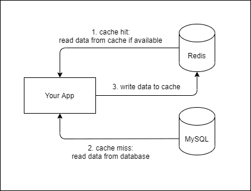
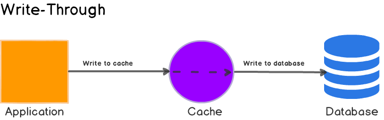
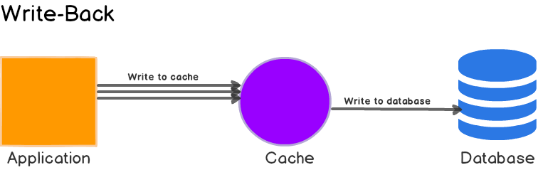

# 캐싱
- **Cache** : 성능 향상을 위해 값을 복사해놓는 임시 기억 장치
- Cache에 복사본을 저장해놓고 읽음으로서 속도가 느린 장치로의 접근 횟수를 줄임
- **Cache의 데이터는 원본이 아니며 언제든 사라질 수 있음**

## 캐시의 적용

- 웹브라우저 끼리의 캐싱도 있다! 
  - e.x. 자바스크립트 소스파일, 이미지,,,
- 서버가 다른 서버를 호출할 때의 캐시
  - 네트워크로 연결되어있고, 한시간마다 데이터를 갱신하면 굳이 접근할 필요가 없기 때문
- 서버와 DB 사이에서도 캐시를 적용할 수 있다.

> 네트워크 지연 감소, 서버 리소스 사용 감소, 병목현상 감소
> 
> DB는 유연하게 확장하기 어려워서 병목 현상을 캐시를 통해 좀 줄일 수 있다!
> 
> 원칙: 더 빠르고 값싸게 가져올 수 있다면, 캐시를 사용한다.

## 캐싱 관련 개념들
- **캐시 적중(Cache Hit)** : 캐시에 접근해 데이터를 발견함!
- **캐시 미스(Cache Miss)** : 캐시에 접근했으나, -> 데이터 발견 X 
- **캐시 삭제 정책(Eviction Policy)** : 캐시의 데이터 공간 확보를 위해 저장된 데이터를 삭제
- **캐시 전략** : 환경에 따라 적합한 캐시 운영 방식을 선택할 수 있음 (Cache-Aside, Write-Through..)

### 캐시 운용 전략

#### Cache-Aside(Lazy Loading)
- 항상 캐시를 먼저 체크하고, 없으면 원본(e.x. DB)에서 읽어온 후에 캐시에 저장함
  - 장점 : **필요한 데이터만 캐시에 저장**, Cache Miss가 있어도 치명적이지 않음!
  - 단점 : **최초 접근은 느림**, 업데이트 주기가 일정하지 않기 때문에 **캐시가 최신 데이터가 아닐 수 있음**!
    - 캐시 유지 기간을 짧게 두어 최신가능성을 높일 수 있다.

#### Write-Through
- 데이터를 쓸 때 항상 캐시를 업데이트하여 최신 상태를 유지
  - 장점 : 캐시가 항상 동기화되어 있어 데이터가 최신
  - 단점 : 자주 사용하지 않는 데이터도 캐시되고, **쓰기 지연시간이 증가**한다.
  - 

#### Write-Back
- 데이터를 캐시에만 쓰고, 캐시의 데이터를 일정 주기로 DB에 업데이트
  - 장점 : 쓰기가 많은 경우 DB 부하를 줄일 수 있음
  - 단점 : 캐시가 DB에 쓰기 전에 장애가 생기면 데이터 유실 가능

---

### 캐시 데이터 제거 방식
- 캐시에서 어떤 데이터를 언제 제거할 것인가? 
  - **Expiration** : 각 데이터에 TTL을 설정해 시간 기반으로 삭제
  - **Eviction Algorithm** : 공간을 확보해야 할 경우 어떤 데이터를 삭제할지 결정하는 방식
    - **LRU(Least Recently Used)** : 가장 오랫동안 사용되지 않은 데이터를 삭제
    - **LFU(Least Frequently Used)** : 가장 적게 사용된 데이터를 삭제(최근에 사용되었더라도)
    - **FIFO(First In First Out)** : 먼저 들어온 데이터 삭제

